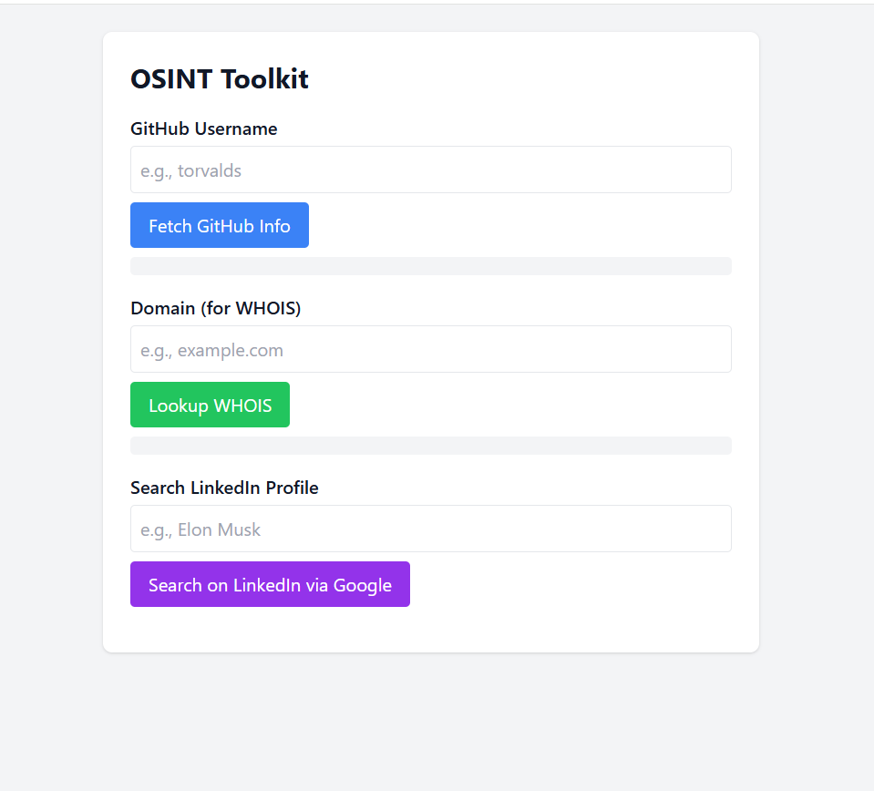

# 🕵️‍♂️ OSINT Toolkit

A lightweight, browser-based OSINT (Open Source Intelligence) tool that enables quick information gathering from public sources like GitHub, WHOIS services, and LinkedIn (via DuckDuckGo search queries). This project is built entirely using HTML, Tailwind CSS, and vanilla JavaScript — no backend or server setup required, making it fully compatible with **GitHub Pages** hosting.

---

## 🚀 Features

- **GitHub Profile Lookup**
  - Fetch public profile data of any GitHub user using the GitHub REST API.
  
- **WHOIS Domain Lookup**
  - Instantly opens WHOIS information for a given domain using the `who.is` public service.

- **LinkedIn Profile Search**
  - Generates a DuckDuckGo search query for a person's name and organization, filtered to `site:linkedin.com/in`.

- **100% Frontend-Only**
  - No server or API keys required (except optional WHOIS APIs).
  - Safe and easy to host on GitHub Pages or any static site provider.

---

## 🛠️ Tech Stack

- **HTML5** – Structural markup
- **Tailwind CSS** – Rapid styling utility classes
- **JavaScript (ES6)** – API calls and DOM manipulation
- **GitHub Pages** – Free static site hosting

---

## 🌐 Live Demo

🔗 [View Live](https://mithul-kumaran.github.io/OSINT-Toolkit/)

---

## 📸 Screenshots

